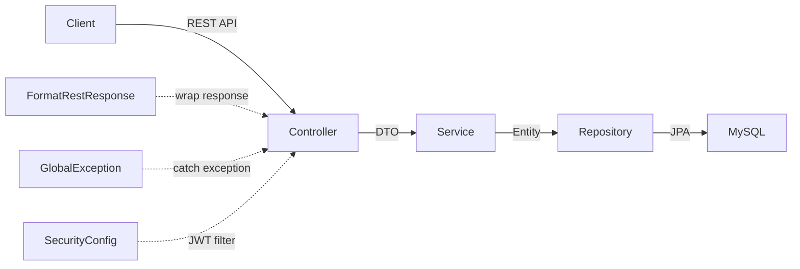
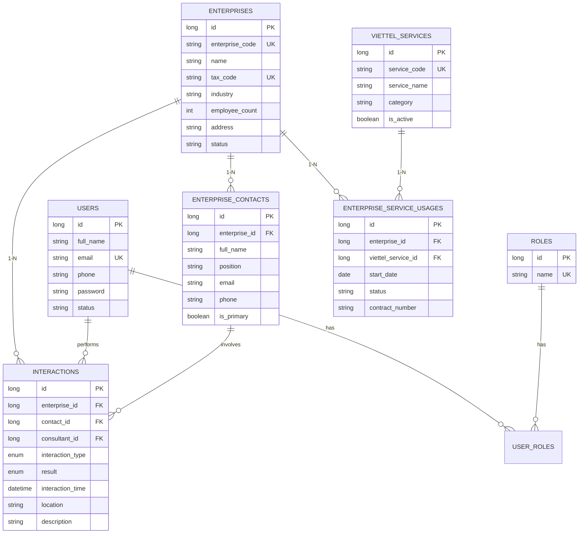

# 🏢 Kế Hoạch Xây Dựng Backend CRM Quản Lý Doanh Nghiệp Nội Bộ

> **Dự án:** `crm-DN-VNR20K-2K` | **Package:** `vn.viettel.khdn.crm_DN_VNR20K_2K`  
> **Stack:** Spring Boot 3.5.11, Java 17, MySQL, JWT (OAuth2 Resource Server), Gradle  
> **Kiến trúc tham chiếu:** [ClinicSystem](https://github.com/nhandeptraiii/ClinicSystem) — Layered Architecture

---

## 1. Kiến Trúc Tổng Quan

Áp dụng **đúng kiến trúc ClinicSystem**, gồm các layer:



| Layer | Mô tả | Pattern từ ClinicSystem |
|-------|--------|------------------------|
| `model/` | JPA Entity + `RestResponse` | `@Entity`, Lombok, `@PrePersist`/`@PreUpdate` |
| `model/dto/` | Request/Response riêng biệt | Tách biệt API contract và entity |
| `model/enums/` | Các giá trị cố định | Type-safe enum |
| `controller/` | REST endpoints + phân quyền | `@RestController`, `@PreAuthorize` |
| `service/` | Business logic | Constructor injection, throw exception |
| `repository/` | Data access | Spring Data JPA, `@Query` |
| `config/` | Security, CORS, Initializer | JWT encode/decode, `BCryptPasswordEncoder` |
| `util/` | **RestResponse wrapper** + Exception handling | `FormatRestResponse`, `GlobalException`, `SecurityUtil` |

### Pattern xử lý Response & Exception (từ ClinicSystem)

```
Thành công:  Controller → return data → FormatRestResponse tự wrap thành RestResponse{statusCode, message, data}
Thất bại:    Service throw exception → GlobalException catch → trả RestResponse{statusCode, error, message}
```

**`RestResponse<T>`** — Response wrapper duy nhất cho toàn bộ API:
```java
public class RestResponse<T> {
    private int statusCode;   // 200, 400, 404...
    private String error;     // Tên lỗi (null khi thành công)
    private Object message;   // "Call API successful" hoặc danh sách lỗi validation
    private T data;           // Dữ liệu trả về
}
```

---

## 2. Thiết Kế Database (7 bảng)



---

## 3. Phân Quyền (3 Roles)

| Chức năng | ADMIN | MANAGER | CONSULTANT |
|-----------|:-----:|:-------:|:----------:|
| Quản lý tài khoản nhân viên | ✅ | ❌ | ❌ |
| Quản lý danh mục dịch vụ Viettel | ✅ | ✅ | ❌ |
| Tạo/Sửa doanh nghiệp | ✅ | ✅ | ✅ |
| Xóa doanh nghiệp | ✅ | ✅ | ❌ |
| Ghi nhận tiếp xúc | ✅ | ✅ | ✅ |
| Xem tất cả tiếp xúc | ✅ | ✅ | ❌ *(chỉ của mình)* |
| Dashboard toàn bộ | ✅ | ✅ | ❌ |

---

## 4. Các Phase Triển Khai

### Phase 1 — Nền Tảng & Bảo Mật *(copy pattern từ ClinicSystem)*

| File | Hành động | Mô tả |
|------|-----------|-------|
| [application.properties](file:///d:/Viettel/crm-DN-VNR20K-2K/src/main/resources/application.properties) | [MODIFY] | Cấu hình MySQL, JWT secret, JPA |
| `model/RestResponse.java` | [NEW] | Response wrapper `{statusCode, error, message, data}` |
| `model/User.java` | [NEW] | Entity nhân viên (ManyToMany → Role) |
| `model/Role.java` | [NEW] | Entity vai trò |
| `model/RevokedToken.java` | [NEW] | Token bị thu hồi |
| `model/dto/LoginDTO.java` | [NEW] | Request đăng nhập |
| `model/dto/ResLoginDTO.java` | [NEW] | Response access token |
| `util/FormatRestResponse.java` | [NEW] | **ResponseBodyAdvice** — tự động wrap response |
| `util/SecurityUtil.java` | [NEW] | Tạo/giải mã JWT token |
| `util/error/GlobalException.java` | [NEW] | **@RestControllerAdvice** — xử lý tất cả exception |
| `util/error/IdInvalidException.java` | [NEW] | Custom exception |
| `config/SecurityConfiguration.java` | [NEW] | JWT decoder/encoder, filter chain, `@EnableMethodSecurity` |
| `config/CorsConfig.java` | [NEW] | CORS cho frontend |
| `config/CustomAuthenticationEntryPoint.java` | [NEW] | Xử lý lỗi 401 |
| `config/RoleInitializer.java` | [NEW] | Tự tạo 3 role: ADMIN, MANAGER, CONSULTANT |
| `config/AdminInitializer.java` | [NEW] | Tạo tài khoản admin mặc định |
| `config/security/RevokedTokenValidator.java` | [NEW] | Validate token chưa bị revoke |
| `service/UserDetailsCustom.java` | [NEW] | Implement `UserDetailsService` |
| `service/UserService.java` | [NEW] | CRUD user |
| `service/RoleService.java` | [NEW] | CRUD role |
| `service/RevokedTokenService.java` | [NEW] | Quản lý revoked tokens |
| `repository/UserRepository.java` | [NEW] | JPA repository |
| `repository/RoleRepository.java` | [NEW] | JPA repository |
| `repository/RevokedTokenRepository.java` | [NEW] | JPA repository |
| `controller/AuthController.java` | [NEW] | POST `/login`, POST `/logout` |
| `controller/UserController.java` | [NEW] | CRUD nhân viên |
| `controller/RoleController.java` | [NEW] | CRUD vai trò |

---

### Phase 2 — Quản Lý Doanh Nghiệp *(Core)*

| File | Hành động | Mô tả |
|------|-----------|-------|
| `model/Enterprise.java` | [NEW] | Entity DN (code, tên, MST, ngành, số NV, địa chỉ) |
| `model/enums/EnterpriseStatus.java` | [NEW] | `PROSPECT`, `ACTIVE_CUSTOMER`, `CHURNED` |
| `model/dto/EnterpriseCreateRequest.java` | [NEW] | DTO tạo DN |
| `model/dto/EnterpriseUpdateRequest.java` | [NEW] | DTO cập nhật DN |
| `model/dto/EnterprisePageResponse.java` | [NEW] | DTO phân trang |
| `repository/EnterpriseRepository.java` | [NEW] | Tìm kiếm theo tên, MST, ngành nghề |
| `service/EnterpriseService.java` | [NEW] | Business logic, auto-gen mã DN |
| `controller/EnterpriseController.java` | [NEW] | CRUD + search `/enterprises` |

---

### Phase 3 — Quản Lý Người Đại Diện

| File | Hành động | Mô tả |
|------|-----------|-------|
| `model/EnterpriseContact.java` | [NEW] | Entity (họ tên, chức vụ, email, SĐT, isPrimary) |
| `model/dto/EnterpriseContactRequest.java` | [NEW] | DTO |
| `repository/EnterpriseContactRepository.java` | [NEW] | JPA repository |
| `service/EnterpriseContactService.java` | [NEW] | Business logic |
| `controller/EnterpriseContactController.java` | [NEW] | CRUD `/enterprises/{id}/contacts` |

---

### Phase 4 — Quản Lý Dịch Vụ Viettel

| File | Hành động | Mô tả |
|------|-----------|-------|
| `model/ViettelService.java` | [NEW] | Danh mục DV (CA, MySign, SInvoice...) |
| `model/EnterpriseServiceUsage.java` | [NEW] | DN dùng DV nào, từ khi nào |
| `model/enums/ServiceUsageStatus.java` | [NEW] | `ACTIVE`, `EXPIRED`, `CANCELLED` |
| `model/dto/ViettelServiceRequest.java` | [NEW] | DTO |
| `model/dto/ServiceUsageRequest.java` | [NEW] | DTO |
| `repository/ViettelServiceRepository.java` | [NEW] | JPA repository |
| `repository/ServiceUsageRepository.java` | [NEW] | JPA repository |
| `service/ViettelServiceService.java` | [NEW] | Business logic |
| `service/ServiceUsageService.java` | [NEW] | Business logic |
| `controller/ViettelServiceController.java` | [NEW] | CRUD `/viettel-services` |
| `controller/ServiceUsageController.java` | [NEW] | CRUD `/enterprises/{id}/service-usages` |

---

### Phase 5 — Quản Lý Mức Độ Tiếp Xúc

> [!IMPORTANT]
> Đây là tính năng **cốt lõi** của CRM — tracking toàn bộ quá trình tư vấn khách hàng.

| File | Hành động | Mô tả |
|------|-----------|-------|
| `model/Interaction.java` | [NEW] | Entity tiếp xúc |
| `model/enums/InteractionType.java` | [NEW] | `PROPOSAL_ONLINE`, `PROPOSAL_OFFLINE`, `PHONE_CALL`, `QUOTE`, `DEMO`, `CLOSE_SALE`... |
| `model/enums/InteractionResult.java` | [NEW] | `PENDING`, `SUCCESSFUL`, `FAILED`, `FOLLOW_UP` |
| `model/dto/InteractionCreateRequest.java` | [NEW] | DTO |
| `model/dto/InteractionPageResponse.java` | [NEW] | DTO phân trang |
| `repository/InteractionRepository.java` | [NEW] | Query theo DN, NV, loại, thời gian |
| `service/InteractionService.java` | [NEW] | Business logic |
| `controller/InteractionController.java` | [NEW] | CRUD + filter `/interactions` |

---

### Phase 6 — Dashboard & Thống Kê

| File | Hành động | Mô tả |
|------|-----------|-------|
| `model/dto/DashboardSummaryResponse.java` | [NEW] | DTO tổng quan |
| `service/DashboardService.java` | [NEW] | Thống kê, báo cáo |
| `controller/DashboardController.java` | [NEW] | GET `/dashboard/summary`, `/dashboard/stats` |

---

## 5. Verification Plan

### Tự động
- Build thành công: `./gradlew build`
- Chạy ứng dụng: `./gradlew bootRun` → khởi động không lỗi
- Test API bằng cURL/Postman: login, CRUD doanh nghiệp, tạo tiếp xúc

### Thủ công
- Kiểm tra database MySQL: các bảng được tạo đúng, quan hệ FK chính xác
- Test phân quyền: CONSULTANT không xóa được DN, không xem được tiếp xúc người khác
- Test response format: mọi API đều trả về dạng `RestResponse{statusCode, message, data}`
